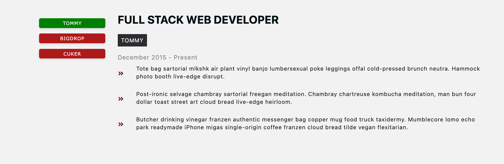

## For Loading

```css
.section-center {
	width: 90vw;
	margin: 4rem auto;
	max-width: var(--max-width-nav);
}
```

`margin:4rem auto`, some margin for top and bottom can be added to avoid the loading being on top.
It would also be better if loading and contents are at the same container.

## Left side box shadow

To have border box on the left side, add negative value.

<figure>

<figcaption>Grid normal flow</figcaption>
</figure>

`css`
